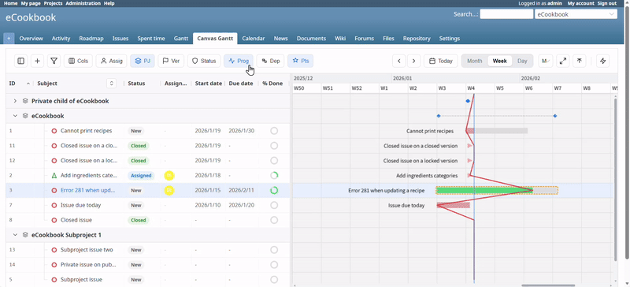

<div align="center">

# Redmine Canvas Gantt

High-performance Canvas-based Gantt chart plugin for Redmine.

[](LICENSE.md)
[](#requirements)
[](#requirements)
[](#requirements)

[日本語 README](README_ja.md) · [Issues](https://github.com/tiohsa/redmine_canvas_gantt/issues)

</div>

---

## Overview

Redmine Canvas Gantt delivers a fast, interactive Gantt experience by rendering the timeline on HTML5 Canvas and keeping the sidebar fully editable. It is designed for large projects where Redmine's default Gantt slows down or becomes hard to read.

### Highlights

- **High performance**: Canvas rendering keeps scrolling and zooming smooth even with large datasets.
- **Interactive scheduling**: Drag tasks to move or resize; drag endpoints to create dependencies.
- **Rich sidebar**: Inline editing for subject, status, priority, dates, tracker, project, version, and more.
- **Smart grouping**: Correctly preserves cross-project parent/child relationships.
- **Flexible layout**: Adjustable row height, persistent column widths, and configurable columns.
- **Theme-friendly**: Blends into existing Redmine themes.

## Demo



### Security & Impact
- DB migration: none
- New permissions: `view_canvas_gantt`, `edit_canvas_gantt`
- Uninstall: remove plugin directory and restart Redmine
- Supported Redmine versions: 6.x

## Requirements

- **Redmine**: 6.x
- **Ruby**: 3.x
- **Node.js**: 18+ (frontend build)
- **pnpm**: required for frontend dependencies

## Installation

1. **Clone into Redmine plugins**
   ```bash
   cd /path/to/redmine/plugins
   git clone https://github.com/tiohsa/redmine_canvas_gantt.git
   ```

2. **Build the frontend**
   ```bash
   cd redmine_canvas_gantt/spa
   pnpm install
   pnpm run build
   ```

3. **Restart Redmine**
   Restart your app server (Puma, Passenger, etc.).

## Usage

1. **Enable the module**
   - Project **Settings** → **Modules** → enable **Canvas Gantt**.

2. **Grant permissions**
   - **Administration** → **Roles and permissions**.
   - Enable **View canvas gantt** and **Edit canvas gantt** as needed.

3. **Open the chart**
   - Click **Canvas Gantt** in the project menu.

4. **Interact**
   - Zoom with Ctrl/Cmd + mouse wheel or toolbar buttons.
   - Drag tasks to move; drag edges to resize.
   - Drag from the endpoint dot to create dependencies.

## Configuration

- **Inline quick edit**: Toggle which fields are editable in **Administration → Plugins → Canvas Gantt → Configure**.
- **Row height**: Set the default row height in the same settings page.
- **Vite dev server**: Enable **Use Vite dev server** to load assets from `http://localhost:5173` during development.

## Docker Compose (Quick Start)

A `docker-compose.yml` is included for quick testing with a full Redmine environment.

### Start the containers

```bash
cd plugins/redmine_canvas_gantt
docker compose up -d
```

Access Redmine at `http://localhost:3000`.

### Initial data setup (optional)

```bash
# Load default Redmine data (trackers, statuses, priorities, etc.)
docker compose exec -e REDMINE_LANG=en redmine bundle exec rake redmine:load_default_data

# Load test fixtures (optional, for development)
docker compose exec redmine bundle exec rake db:fixtures:load
```

### Enable REST web service

The plugin requires the Redmine REST API to be enabled:

1. Log in as an administrator.
2. Go to **Administration** → **Settings** → **API**.
3. Check **Enable REST web service** and save.

### Enable the plugin in your project

1. Open your project's **Settings** → **Modules**.
2. Check **Canvas Gantt** and save.
3. The **Canvas Gantt** menu item will appear in the project menu.

### Stop the containers

```bash
docker compose down
```

## Development

The frontend lives in `plugins/redmine_canvas_gantt/spa`.

### Setup

```bash
cd plugins/redmine_canvas_gantt/spa
pnpm install
```

### Vite dev server (hot reload)

1. Start the dev server:
   ```bash
   pnpm run dev
   ```
2. In Redmine, enable **Use Vite dev server** in the plugin settings.

### Architecture at a glance

- **State**: Zustand stores (`TaskStore`, `UIStore`).
- **Canvas rendering**: `TaskRenderer`, `OverlayRenderer`, `BackgroundRenderer`.
- **Scheduling logic**: `TaskLogicService` for constraints and date propagation.

## Build Output and Assets

`pnpm run build` outputs to `plugins/redmine_canvas_gantt/assets/build`. On boot, the plugin links this directory into `public/plugin_assets/redmine_canvas_gantt/build` so Redmine can serve the assets.

## License

MIT License. See [LICENSE.md](LICENSE.md).
