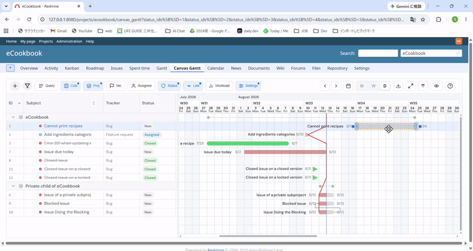

<div align="center">

# Redmine Canvas Gantt

A fast, low-risk, Canvas-based Gantt chart plugin for Redmine 6.0, 6.1, and 7.0.

## Why this plugin?

Built for Redmine projects that need **faster Gantt rendering**,
**interactive scheduling**, and a **low-risk installation without database migrations**.

## Key benefits

**Performance** — Fast Canvas rendering with smooth scrolling and zooming
**Editing** — Drag, resize, dependency editing, and inline issue editing
**Operations** — No database migration and easy uninstall
**Compatibility** — Redmine 6.0 compatibility; Redmine 6.1 and 7.0 full support

Listed on Redmine Plugins Directory:
https://www.redmine.org/plugins/redmine_canvas_gantt

[](LICENSE)
[](https://github.com/tiohsa/redmine_canvas_gantt/actions/workflows/ci.yml)
[](https://github.com/tiohsa/redmine_canvas_gantt/releases)
[](#requirements)
[](#requirements)
[](#requirements)

[日本語 README](README_ja.md) · [Releases](https://github.com/tiohsa/redmine_canvas_gantt/releases) · [Issues](https://github.com/tiohsa/redmine_canvas_gantt/issues)

</div>

---

## Overview

Redmine Canvas Gantt renders the timeline on HTML5 Canvas while keeping the left task list editable. It is designed for projects where the default Redmine Gantt view becomes hard to read or slow to operate.

Baseline snapshots are stored in Redmine's plugin settings (`Setting.plugin_redmine_canvas_gantt`), not in browser storage and not in a separate table. Each project has one snapshot; saving a new snapshot replaces the previous one.

## Highlights

- Fast Canvas rendering with smooth scrolling and zooming
- Drag tasks to move them, resize date ranges, and create dependencies from task endpoints
- Dependency management with create, update, and delete operations
- Inline quick edit for subject, assignee, status, progress, due date, and custom fields
- Drag and drop in the sidebar to change parent-child relationships
- Bulk child task creation from multiple subject lines
- Baseline snapshots for visual comparison, saved for either the current filtered view or the whole project
- Saved queries, Redmine query editing, and round-tripping back to the issue list with supported filters
- Filters by subject text, project, tracker, target version, assignee, and status; tracker filters round-trip through saved and Redmine queries
- Grouping by project or assignee; target-version headers are a display toggle, not a grouping mode
- Workload pane, export to PNG or CSV, full screen mode, and toolbar controls for zoom, row height, and font size
- Display settings stored per project or shared across all projects in the same browser profile (not across Redmine users)
- Version headers, progress line, hierarchy lines, orphan date points, task titles, and dependency-based organization

## Demo



## Requirements

- Redmine 6.0 (compatibility), 6.1, or 7.0
- A Ruby version supported by the selected Redmine version
- Node.js 20+ only for building the SPA or running frontend development tools; Node.js is not required for normal Redmine operation when prebuilt assets are used
- REST API enabled in Redmine

### Supported browsers

Use a current desktop version of Chrome, Edge, Firefox, or Safari with HTML5 Canvas, ES modules, and `localStorage` enabled. Internet Explorer is not supported. Mobile browsers and embedded webviews are not part of the supported test matrix.

### Security and impact

- Database migration: none
- Added permissions: `view_canvas_gantt`, `manage_canvas_gantt_baseline`
- Uninstall: run the cleanup task from the Redmine application environment before removing the plugin directory. For Docker Compose, run it inside the `redmine` service container. The task deletes the complete Redmine plugin settings row, including stored baselines. Browser `localStorage` remains local to each user and is not removed by the server-side task.

## Installation

1. Clone the plugin into Redmine's `plugins/` directory.

   ```bash
   cd /path/to/redmine/plugins
   git clone https://github.com/tiohsa/redmine_canvas_gantt.git
   ```

2. Restart Redmine.

   Restart your application server after placing the plugin.

### Upgrade

1. Back up the Redmine database and the plugin directory.
2. Replace the plugin directory with the desired release (for example, update the Git checkout or extract the release over it).
3. If you build the SPA from source, run `cd spa && npm ci && npm run build` with Node.js 20+.
4. Restart Redmine and verify the plugin module and permissions.

This plugin does not provide database migrations. Existing baselines in Redmine settings and browser display preferences are retained during upgrades.

### Uninstall

1. Back up the Redmine database if stored baselines or plugin settings may be needed later.
2. Run the idempotent cleanup task while the plugin directory is still present.

   **Standard installation** — run from the Redmine application directory that contains `Gemfile`:

   ```bash
   cd /path/to/redmine
   bundle exec rake redmine_canvas_gantt:uninstall RAILS_ENV=production
   ```

   **Docker Compose** — run inside the Redmine service container:

   ```bash
   docker compose exec -T redmine \
     bundle exec rake redmine_canvas_gantt:uninstall
   ```

   `RAILS_ENV=production` is already configured in this repository's Compose service. To set it explicitly:

   ```bash
   docker compose exec -T -e RAILS_ENV=production redmine \
     bundle exec rake redmine_canvas_gantt:uninstall
   ```

   Do not run `bundle exec` from the host plugin directory when Redmine itself runs only in Docker. The host directory does not contain Redmine's `Gemfile`, so Bundler reports `Could not locate Gemfile or .bundle/ directory`.

3. Remove the `plugins/redmine_canvas_gantt` directory, or remove the corresponding plugin volume or bind mount from the container configuration.
4. Restart Redmine.

The cleanup task deletes the `plugin_redmine_canvas_gantt` row from Redmine's `settings` table, including all baseline snapshots and plugin defaults stored there. It does not clear browser `localStorage`.

## Usage

1. Enable the REST API.
   Go to **Administration** -> **Settings** -> **API** and enable **Enable REST web service**.

2. Enable the project module.
   Open **Project** -> **Settings** -> **Modules** and enable **Canvas Gantt**.

3. Grant permissions.
   In **Administration** -> **Roles and permissions**, grant `view_canvas_gantt` to use Canvas Gantt. Issue actions use Redmine's standard permissions on the target issue's project: `edit_issues`, `delete_issues`, `add_issues`, and `manage_subtasks`. Grant `manage_canvas_gantt_baseline` only to roles allowed to save a baseline.

   When upgrading from a version that used `edit_canvas_gantt`, review affected roles: that retired permission is not migrated automatically. Grant `manage_canvas_gantt_baseline` only where baseline saving should remain available; no Canvas-specific permission is needed for normal Issue actions.

4. Open the chart.
   Click **Canvas Gantt** from the project menu.

5. Use the chart and toolbar.
   - Zoom with Ctrl/Cmd + mouse wheel or the toolbar controls.
   - Drag tasks to move them on the timeline.
   - Drag task edges to resize date ranges.
   - Drag from endpoint dots to create dependencies.
   - Open dependency editing to change the relation type, delay, or remove the relation.
   - Drag a sidebar row onto another task to make it a child issue.
   - Use bulk subtask creation to add multiple child issues at once.
   - Open the workload pane to review capacity and focus filters.
   - Use display settings to save and share UI preferences across projects.
   - Export the current view as PNG or CSV when the layout supports it.
   - Toggle full screen for more workspace when needed.

### Baseline snapshots

- Baseline is comparison-only. It is not used for scheduling or CPM calculations.
- Each project stores a single baseline snapshot, and saving a new one replaces the previous snapshot.
- The toolbar lets you save either the current filtered view or the whole project as the baseline scope.
- Baseline bars and diff popovers only render for tasks currently visible in the chart, even when the saved scope was the whole project.
- Viewing baseline comparison requires `view_canvas_gantt`. Saving a baseline requires `manage_canvas_gantt_baseline`.
- Baselines are stored in `Setting.plugin_redmine_canvas_gantt` in Redmine's settings area. Removing the plugin directory alone does not delete them; run the uninstall cleanup task first.

### Workload, display settings, and export

- The workload pane can show daily capacity, peak and total workload, and filters for leaf issues, closed issues, and today-onward focus.
- Display settings are stored in the browser's `localStorage`, not on a Redmine user record. Project mode applies to that project; global mode applies across projects in that same browser profile. It does not change settings in other browser profiles, but anyone using the same browser profile will see them. Settings cover zoom level, view mode, chart position, progress line, task titles, hierarchy lines, orphan date points, version headers, baseline visibility, visible columns, column order, dependency-based organization, column widths, sidebar width, custom zoom scales, row height, and font size.
- The configuration screen also supports tracker icon mapping with a JSON object that maps tracker IDs to icon kinds.
- Auto save determines whether edits are committed immediately or kept pending until you save them manually.
- The help dialog documents the current toolbar actions and editing flows if you need a quick refresher in the UI.

## Shared views, filters, and query parameters

URL parameters and saved Redmine queries are the shareable contract for business conditions: status, assignee, project, target version, subproject visibility, grouping, sorting, and visible columns. The subject-text filter and workload focus filters are personal browser state and are not shared. The last resolved query is kept in `localStorage` only as a per-user fallback when a bare Canvas Gantt URL is opened.

Display settings are also browser-profile preferences, not Redmine user settings. “Shared across all projects” means all projects in the same browser profile, not all Redmine users. See [URL and query parameters](QUERY_PARAMETERS.md) for the complete parameter list, Redmine compatibility rules, precedence, and examples.

Canvas Gantt uses Redmine's standard issue list for creating and editing saved queries. The toolbar can open the current query in an iframe or a new tab, and **Open in Canvas Gantt** returns with supported URL state.

## Configuration

Canvas Gantt does not expose a plugin configuration screen. UI defaults are fixed in code, and baseline snapshots are stored internally in `Setting.plugin_redmine_canvas_gantt` without requiring a database migration. The setting is Redmine-wide storage; baseline access is still limited by the project permissions described above.

To use the Vite dev server during development, set `CANVAS_GANTT_USE_VITE_DEV_SERVER=1`.

### Data payload safety limits

The data endpoint rejects an oversized complete payload with HTTP 413 instead of returning a truncated task graph. The built-in finite maxima are 10,000 issues, 50,000 relations, 10,000 auxiliary collection entries, and 25 MiB of encoded JSON. Administrators may lower, but cannot raise, those hard maxima with these environment variables:

- `REDMINE_CANVAS_GANTT_MAX_DATA_ISSUES`
- `REDMINE_CANVAS_GANTT_MAX_DATA_RELATIONS`
- `REDMINE_CANVAS_GANTT_MAX_DATA_COLLECTION_ITEMS`
- `REDMINE_CANVAS_GANTT_MAX_DATA_BYTES`

### Business calendars

Canvas Gantt can use named business calendars for weekly non-working days, country holidays, company shutdowns, and substitute working days. The same resolved calendar drives dependency validation, automatic scheduling, critical-path calculations, Canvas background shading, and direct task-date changes. When a non-working day is selected during Gantt drag/resize or sidebar date editing, the start date is normalized forward to the next working day and the due date backward to the previous working day. This feature requires no database migration. Holiday data is read-only runtime configuration stored in external YAML files; it is never stored in `Setting.plugin_redmine_canvas_gantt`.

The default directory is `<Rails.root>/config/redmine_canvas_gantt/business_calendars`. Set `REDMINE_CANVAS_GANTT_CALENDAR_DIR` to use another directory. Copy [the bundled examples](examples/business_calendars/) as a starting point:

```text
business_calendars/
├── settings.yml
├── generated/JP.yml
├── generated/US.yml
└── custom/company-us.yml
```

`settings.yml` selects the Redmine-wide default and assigns calendars by project identifier. A child project inherits the nearest parent assignment.

```yaml
schema_version: 1
default_calendar: company-us
project_calendars:
  us-project: company-us
  japan-project: JP
```

A custom calendar can inherit a generated country calendar. `non_working` adds a company holiday; `working` overrides a country holiday or weekly non-working day.

```yaml
schema_version: 1
calendar:
  id: company-us
  name: US Company Calendar
  base: US
  managed: false
days:
  - date: 2027-08-12
    name: Company summer holiday
    type: non_working
  - date: 2027-09-18
    name: Substitute workday
    type: working
```

Country files can be generated without adding the `holidays` gem to Redmine's production bundle:

```bash
cd tools/holiday_generator
bundle install
bundle exec ruby generate.rb --region us --calendar-id US --name United States \
  --from 2026 --to 2030 \
  --output /path/to/business_calendars/generated/US.yml
```

Keep company changes in `custom/`; `--force` replaces only files marked `calendar.managed: true`. The runtime checks relative path, modification time, and size every 60 seconds and atomically swaps in a fully validated snapshot after a change. Set `REDMINE_CANVAS_GANTT_CALENDAR_RELOAD_INTERVAL` to another non-negative number of seconds. Symlinks that resolve outside the configured calendar root are rejected; symlinked directories are not traversed. A missing directory or `settings.yml` falls back to Redmine's standard non-working weekdays. An invalid configuration logs a warning and continues calendar-dependent relation and auto-schedule operations with that same weekday fallback; a failed reload logs a warning and retains the last valid snapshot.

For Docker, set the directory explicitly and mount the calendar directory. The official Redmine image
changes ownership of the configuration directory during startup, so omit `:ro` when using that image.
The plugin treats holiday data as read-only after startup.

```yaml
services:
  redmine:
    environment:
      REDMINE_CANVAS_GANTT_CALENDAR_DIR: /etc/redmine/business_calendars
    volumes:
      - ./business_calendars:/etc/redmine/business_calendars
```

For Kubernetes, mount one read-only ConfigMap (or another read-only volume) at the same path and set the same environment variable. Every Puma worker keeps an independent in-memory snapshot, and every Pod must see identical files. ConfigMap updates are detected on the next reload check; there is no real-time push.

Uninstalling the plugin does not delete this external directory or ConfigMap. Remove it separately only when its holiday data is no longer needed. This preserves the existing **No database migration** and easy-uninstall behavior.

### Compatibility note

If `redmica_ui_extension` applies Select2 behavior that interferes with Canvas Gantt controls, open **Administration** -> **Plugins** -> **Redmica UI Extension** -> **Configure** and disable searchable select boxes.

## Docker Quick Start

This repository includes `docker-compose.yml` for running a local Redmine 7.0.0 + MariaDB 11.4 environment. Set `REDMINE_IMAGE` to `redmine:6.0.6` or `redmine:6.1.2` to run a compatibility version instead.

GitHub Actions continuously verifies Redmine 6.0.6, 6.1.2, and 7.0.0 with backend specs and Redmine E2E coverage. Redmine 6.0.6 runs the targeted compatibility suite (smoke, business calendar, mutation contract, and baseline permissions). Redmine 6.1.2 and 7.0.0 run the full Redmine Playwright suite. Redmine 7.0.0 is also validated locally with the MariaDB 11.4 Compose database.

To use a custom holiday calendar, add the following settings to the `redmine` service. Place
`settings.yml` and the calendar YAML files under `business_calendars/`, including the `generated/`
and `custom/` directories.

```yaml
services:
  redmine:
    environment:
      RAILS_ENV: production
      REDMINE_CANVAS_GANTT_CALENDAR_DIR: /usr/src/redmine/config/redmine_canvas_gantt/business_calendars
    volumes:
      - ./business_calendars:/usr/src/redmine/config/redmine_canvas_gantt/business_calendars
```

Do not use `RAILS_ENV: development` with the official image unless the `listen` gem is added separately;
the image does not include it by default.

### Start the stack

```bash
docker compose up -d --wait
```

To start Redmine 6.1.2 instead:

```bash
REDMINE_IMAGE=redmine:6.1.2 docker compose up -d --wait
```

For Redmine 6.0.6, use `REDMINE_IMAGE=redmine:6.0.6`.

Open Redmine at [http://localhost:3000](http://localhost:3000).

### Load initial data

```bash
docker compose exec -T -e REDMINE_LANG=en redmine bundle exec rake redmine:load_default_data
docker compose exec -T redmine bundle exec rake db:fixtures:load
```

### Enable Canvas Gantt in a project

1. Open the target project.
2. Go to **Settings** -> **Modules**.
3. Enable **Canvas Gantt**.
4. Ensure the active role has `view_canvas_gantt` and the relevant standard Issue permissions if editing is required. To save baselines, also grant `manage_canvas_gantt_baseline`.

### Stop the stack

```bash
docker compose down
```

## Development

The SPA frontend lives in `spa/`.

```bash
cd spa
npm ci
npm run build
npm run lint
npm run test -- --run
```

For live frontend development:

```bash
cd spa
npm run dev
```
