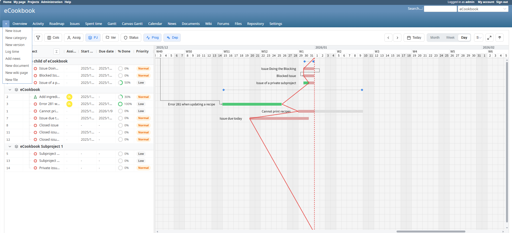

<div align="center">

# Redmine Canvas Gantt

Redmine向けの高性能 Canvas ガントチャートプラグイン。

[](LICENSE.md)
[](#動作環境)
[](#動作環境)
[](#動作環境)

[English README](README.md) · [Issues](https://github.com/tiohsa/redmine_canvas_gantt/issues)

</div>

---

## 概要

Redmine Canvas Gantt は、HTML5 Canvas を活用して高速にタイムラインを描画し、サイドバーからの直接編集も可能にしたガントチャートです。大量チケットを扱うプロジェクトでも、滑らかな操作感と高い視認性を提供します。

### 主な特長

- **高パフォーマンス**: Canvas 描画により、大規模データでもスクロールやズームが軽快です。
- **直感的なスケジューリング**: ドラッグで移動・期間変更、端点ドラッグで依存関係を作成できます。
- **リッチなサイドバー**: 件名、ステータス、優先度、日付、トラッカー、プロジェクトなどをインライン編集。
- **スマートな集約表示**: プロジェクトを跨ぐ親子関係でも正しい階層で表示します。
- **柔軟なレイアウト**: 行高の調整、列幅の保存、表示列のカスタマイズに対応。
- **テーマ対応**: Redmine のテーマと自然に馴染みます。

## スクリーンショット


## 動作環境

- **Redmine**: 6.x
- **Ruby**: 3.x
- **Node.js**: 18以上（フロントエンドビルド用）
- **pnpm**: フロントエンド依存管理に必要

## インストール

1. **plugins 配下にクローン**
   ```bash
   cd /path/to/redmine/plugins
   git clone https://github.com/tiohsa/redmine_canvas_gantt.git
   ```

2. **フロントエンドのビルド**
   ```bash
   cd redmine_canvas_gantt/spa
   pnpm install
   pnpm run build
   ```

3. **Redmine の再起動**
   Puma/Passenger などのアプリサーバーを再起動してください。

## 使い方

1. **モジュールを有効化**
   - プロジェクトの **設定** → **モジュール** で **Canvas Gantt** を有効化。

2. **権限の付与**
   - **管理** → **ロールと権限** から **View canvas gantt** と **Edit canvas gantt** を設定。

3. **チャートを開く**
   - プロジェクトメニューの **Canvas Gantt** をクリック。

4. **基本操作**
   - Ctrl/Cmd + ホイール、またはツールバーでズーム。
   - チケットをドラッグして移動、端をドラッグして期間変更。
   - 端点のドットからドラッグして依存関係を作成。

## 設定

- **インライン編集項目**: **管理 → プラグイン → Canvas Gantt → 設定** で編集可能項目を切り替え。
- **行の高さ**: 同じ画面でデフォルト行高を設定。
- **Vite dev server**: 開発時は **Use Vite dev server** を有効化し、`http://localhost:5173` から読み込み。

## Docker Compose（クイックスタート）

プラグインに `docker-compose.yml` が含まれており、Redmine 環境を素早く起動できます。

### コンテナの起動

```bash
cd plugins/redmine_canvas_gantt
docker compose up -d
```

`http://localhost:3000` で Redmine にアクセスできます。

### 初期データの投入（任意）

```bash
# デフォルトデータ（トラッカー、ステータス、優先度など）をロード
docker compose exec -e REDMINE_LANG=ja redmine bundle exec rake redmine:load_default_data

# テストフィクスチャをロード（開発用、任意）
docker compose exec redmine bundle exec rake db:fixtures:load
```

### コンテナの停止

```bash
docker compose down
```

## 開発

フロントエンドは `plugins/redmine_canvas_gantt/spa` にあります。

### セットアップ

```bash
cd plugins/redmine_canvas_gantt/spa
pnpm install
```

### Vite dev server（ホットリロード）

1. Dev サーバー起動:
   ```bash
   pnpm run dev
   ```
2. Redmine の設定画面で **Use Vite dev server** を有効化。

### アーキテクチャ概要

- **状態管理**: Zustand ストア（`TaskStore`, `UIStore`）。
- **Canvas 描画**: `TaskRenderer`, `OverlayRenderer`, `BackgroundRenderer`。
- **スケジューリング**: `TaskLogicService` で制約と日付伝播を管理。

## ビルド成果物と配信

`pnpm run build` の成果物は `plugins/redmine_canvas_gantt/assets/build` に出力されます。起動時に `public/plugin_assets/redmine_canvas_gantt/build` へリンクされ、Redmine から配信されます。

## ライセンス

MIT License. 詳細は [LICENSE.md](LICENSE.md) を参照してください。
